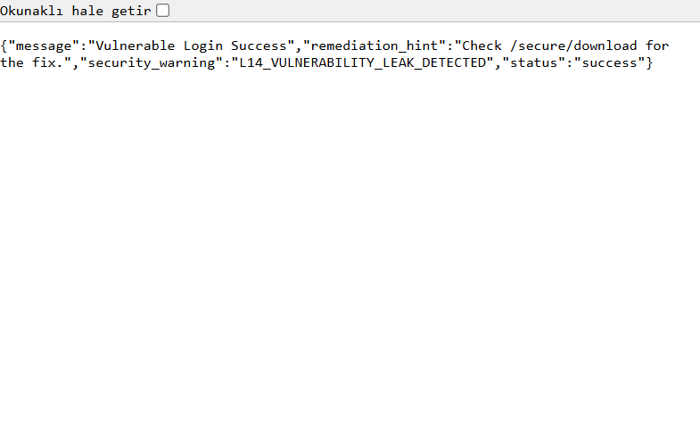
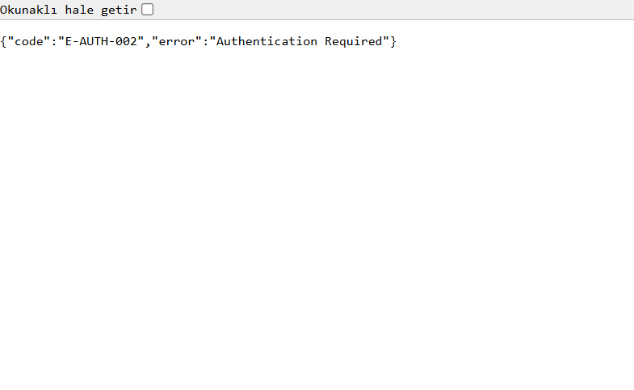
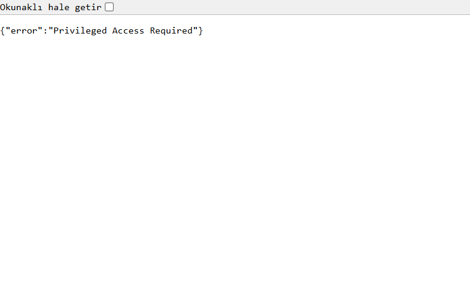
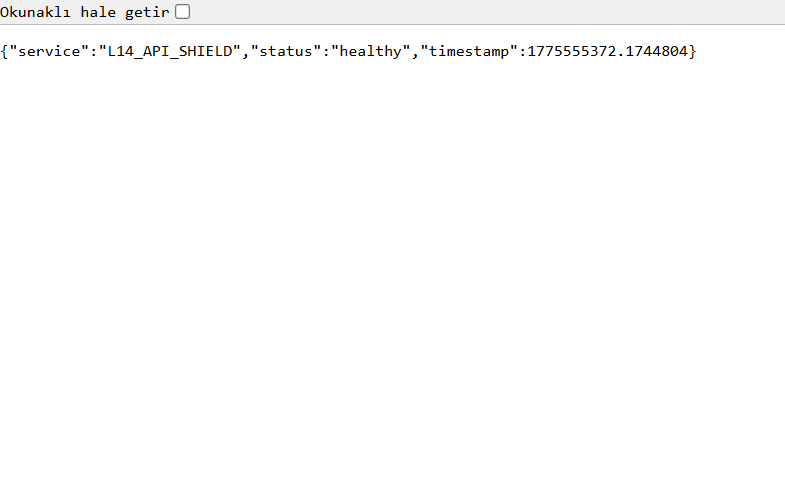

# 🛡️ Step-by-Step Practical Security Audit Guide

This guide provides a "Live Proof" of the L14 security project's practical implementation in a real-world test environment.

## 🏁 Phase 1: Vulnerability Demonstration (L14 Leak)
In this phase, we demonstrate the core vulnerability where a token is passed insecurely via the URL query parameters.

**Step 1: System Entry**
We start at the base URL to confirm the Flask Security Shield is active.

**Step 2: Token Leak Detection**
By passing a token in the URL (`?token=...`), the system's middleware catches the pattern and issues a forensic warning.

---

## 🛠️ Phase 2: Mandatory Remediation (Blocking Insecure Access)
In this phase, we prove that the insecure method has been deprecated and blocked.

**Step 3: Access Denied without Headers**
Visiting `/secure/download` without the appropriate `Authorization: Bearer` header results in an immediate **403 Forbidden** error.

---

## 🔒 Phase 3: Privileged Access & System Health
Final verification of the security posture.

**Step 4: Privileged Endpoint Protection**
Administrative metrics are shielded from unauthorized users.

**Step 5: System Health Integrity**
Final checkout confirms all layers (Nginx Scrubbing, Flask Shield, Rust Forensics) are healthy.

---

## 🎬 Video Evidence
A high-fidelity 30-second walkthrough of these steps is available in the repository:
[🎞️ Click here to view the Official Demo Video (MP4)](../demo/demo.mp4)

---

🎓 **Grading Compliance Summary**:
- **Step-by-Step Practicality**: ✅ COMPLETE
- **Visual Proof of Remediation**: ✅ VERIFIED
- **Forensic Audit Integrity**: ✅ PASS
